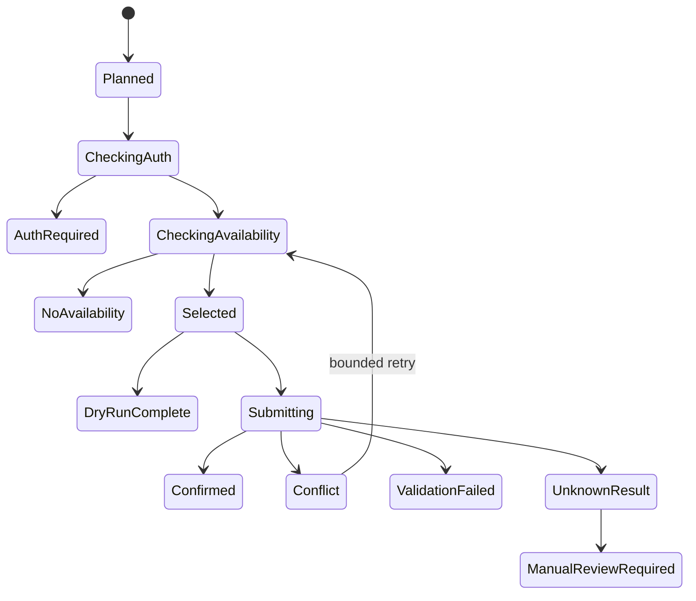

# Product Requirements Document: Hayden Room Booker

**Version:** 1.0  
**Status:** Implementation-ready MVP specification  
**Primary platform:** Windows 10/11  
**Secondary platforms:** macOS and Linux  
**Target implementation:** Python 3.12+ and Playwright  
**Target site:** ASU Hayden Library LibCal study-room reservations

---

## 1. Product Summary

Room Sniper is a local, single-user automation tool that reserves ASU Hayden Library study rooms according to a preconfigured recurring weekly schedule.

The application stores weekly preferences such as “Monday from 1:30 PM to 3:30 PM” and a ranked list of acceptable rooms. When the relevant future date becomes bookable, the application opens ASU LibCal using a dedicated browser profile that the user has already authenticated, finds one room with the complete requested interval available, submits the reservation, enters the user's school ID, verifies the resulting confirmation state, and records the outcome locally.

The application must not bypass ASU SSO, Duo, CAPTCHA, rate limits, or any other access control. Authentication is established manually by the user and reused through a dedicated persistent browser profile.

### Product principle

The tool should behave like a careful user executing one authorized reservation—not like a scraper or high-frequency bot.

---

## 2. Problem Statement

The user wants the same Hayden study-room times most weeks. The current workflow is repetitive and time-sensitive:

1. Open the Hayden LibCal page.
2. Find the newly available future date.
3. Find a room with the complete desired interval.
4. Select the half-hour slots.
5. Submit the selected times.
6. Pass through ASU authentication if the existing session is not recognized.
7. Confirm the prefilled name and ASU email.
8. Enter the school ID.
9. Submit the reservation and confirm success.

Previous automation failed because Playwright launched a clean browser. ASU therefore treated every run as a new browser and redirected it to the ASURITE sign-in flow. The new system must preserve the browser profile and fail safely when interactive authentication is required.

---

## 3. Goals

### 3.1 MVP goals

1. Let the user define recurring weekly desired times and ranked room preferences in a human-readable configuration file.
2. Reuse a dedicated, persistent Playwright browser profile authenticated manually by the user.
3. Use LibCal's accessible reservation interface and semantic labels rather than screen coordinates.
4. Resolve the correct target date from the intended weekday and the dates currently offered by LibCal.
5. Find one room containing every requested half-hour slot.
6. Submit at most one reservation for each configured schedule occurrence.
7. Detect expired authentication and notify the user without attempting to enter a password or complete Duo.
8. Store local attempt history and prevent duplicate submissions.
9. Support safe dry runs that stop before any action that creates a reservation.
10. Produce actionable logs and exit codes suitable for Windows Task Scheduler.

### 3.2 Success metrics

- At least 95% of scheduled runs with valid authentication and available rooms reach a verified confirmation state.
- Zero duplicate reservations caused by the application.
- Zero passwords, Duo codes, session cookies, school IDs, or authentication profiles committed to source control or written to ordinary logs.
- Authentication expiration is detected and reported within one scheduled run.
- No production run performs more than three booking attempts or polls more frequently than the configured minimum interval.

---

## 4. Non-Goals

The MVP will not:

- Bypass, weaken, or programmatically solve ASU SSO, Duo, CAPTCHA, bot detection, or other access controls.
- Store the ASURITE password or Duo credentials.
- Copy browser cookies to GitHub Actions, a cloud VM, or another device.
- Use multiple ASU accounts or make reservations for other people.
- Mass-book rooms, hoard speculative reservations, or exceed ASU's published daily limit.
- Cancel or modify existing reservations.
- Reverse-engineer or call undocumented LibCal booking POST endpoints directly.
- Read the user's email inbox to confirm a reservation.
- Provide a web dashboard or mobile application in the MVP.
- Guarantee a reservation when the desired interval is unavailable.

---

## 5. Current External Constraints

The implementation must treat these values as configurable constants because ASU or LibCal may change them.

### 5.1 Known Hayden rules

- Reservations may be made up to seven days in advance.
- Reservations use half-hour increments.
- A person may reserve up to four hours per day.
- Reservations are restricted to current ASU students, faculty, and staff.
- The current Hayden inventory contains 18 reservable study rooms.

### 5.2 Known LibCal identifiers

```yaml
libcal:
  base_url: "https://asu.libcal.com"
  standard_booking_path: "/reserve/hayden-study"
  accessible_booking_path: "/r/accessible?lid=13858&gid=28619"
  location_id: 13858
  group_id: 28619
```

### 5.3 Known room names and observed IDs

Room names are the primary identifiers. Numeric IDs are diagnostic fallbacks only.

| Room | Observed LibCal ID |
| --- | ---: |
| Study Room 311A | 108072 |
| Study Room 311B | 108073 |
| Study Room 311C | 108074 |
| Study Room 336 | 108078 |
| Study Room 342 | 108077 |
| Study Room 351 | 108079 |
| Study Room 353 | 108080 |
| Study Room 355 | 108081 |
| Study Room 357 | 108088 |
| Study Room C13 | 108065 |
| Study Room C15 | 108066 |
| Study Room C17 | 108067 |
| Study Room C19 | 108068 |
| Study Room C38 | 117803 |
| Study Room C40 | 117804 |
| Study Room L52 | 108062 |
| Study Room L54 | 108063 |
| Study Room L56 | 108064 |

### 5.4 Authentication chain

The observed booking flow redirects through these systems when authentication is required:

```text
asu.libcal.com
  -> Springshare LibAuth
  -> ASU Shibboleth
  -> ASU CAS at weblogin.asu.edu
  -> LibCal booking form
```

The application must preserve all relevant browser state through a dedicated persistent browser directory. It must not assume that saving only one `asu.libcal.com` cookie is sufficient.

### 5.5 Unknown release time

ASU documents the seven-day window but not the exact time at which a new date becomes available. The application must therefore:

1. Make the release time configurable.
2. Default to `00:00` in `America/Phoenix` only as an initial assumption.
3. Include an observation mode that measures when the target date first becomes available without selecting or submitting a reservation.
4. Never poll more frequently than once every 30 seconds.

---

## 6. User Stories

### US-1: Configure a recurring schedule

As the user, I want to define the weekday, start time, end time, and acceptable rooms so that the application knows exactly what to reserve each week.

### US-2: Establish authentication manually

As the user, I want a setup command to open a dedicated browser where I can sign in to ASU myself so that the application can reuse the authenticated session safely.

### US-3: Preview a booking

As the user, I want a dry run that reports the target date, available rooms, and room it would select without creating a reservation.

### US-4: Run scheduled reservations

As the user, I want the application to run automatically when a new relevant date becomes bookable and reserve the first acceptable room containing the full requested time.

### US-5: Recover from expired authentication

As the user, I want to receive a clear notification when ASU requires sign-in so that I can refresh the session before the next booking.

### US-6: Avoid duplicates

As the user, I want repeated or delayed scheduler invocations to recognize an already successful reservation and exit without submitting again.

### US-7: Understand failures

As the user, I want concise status messages and locally retained diagnostics so I can tell whether a failure came from authentication, changed page structure, unavailable rooms, network failure, or a booking conflict.

---

## 7. User Experience and CLI

The MVP is a command-line application named `hayden-booker`.

### 7.1 Required commands

```text
hayden-booker init
hayden-booker auth setup
hayden-booker auth check
hayden-booker secret set-school-id
hayden-booker config validate
hayden-booker schedule show
hayden-booker observe-release
hayden-booker run --dry-run
hayden-booker run --due
hayden-booker run --schedule-id <id> --target-date YYYY-MM-DD --dry-run
hayden-booker history
hayden-booker doctor
```

### 7.2 Command behavior

#### `init`

- Create a sample `config.yaml` if one does not exist.
- Create application data directories.
- Initialize the SQLite database.
- Create or verify `.gitignore` entries.
- Never create fake credentials.

#### `auth setup`

- Launch the dedicated persistent browser profile in headed mode.
- Navigate to the Hayden booking page.
- Tell the user to complete ASU sign-in in the opened browser.
- Never accept credentials through CLI arguments, configuration, logs, or chat.
- Wait until the browser returns to `asu.libcal.com` and shows an authenticated booking step or until the user exits.
- Close cleanly and retain the profile.

#### `auth check`

- Launch the persistent profile.
- Follow a non-submitting path far enough to determine whether ASU authentication would be required.
- Return `0` when authenticated and `20` when interactive authentication is required.
- Do not select or submit a reservation.

#### `secret set-school-id`

- Prompt without echo where supported.
- Save the value in the operating-system credential store through Python `keyring`.
- Never place the value in YAML, SQLite, screenshots, or standard logs.

#### `observe-release`

- Inspect only the date and availability controls.
- Record when the seventh-day target first becomes visible.
- Default maximum observation window: 15 minutes.
- Default interval: 30 seconds.
- Never select slots or click a submit button.

#### `run --dry-run`

- Execute date resolution and availability matching.
- Report which room would be selected.
- Stop before `Submit Times` or any equivalent state-changing action.
- Dry-run must be the default if neither `--dry-run` nor `--live` is specified.

#### `run --due`

- Identify all enabled schedule rules whose intended target date has newly entered the bookable window.
- Process each rule independently.
- Skip any occurrence already marked `CONFIRMED`.
- Require `live_booking_enabled: true` in configuration before submitting.

#### `doctor`

- Validate Python and Playwright installation.
- Check browser availability.
- Check configuration and time zone.
- Check whether the application lock is stale.
- Verify the credential-store entry exists without printing it.
- Check authentication without creating a reservation.
- Print specific remediation steps.

---

## 8. Configuration Requirements

### 8.1 Example `config.yaml`

```yaml
version: 1
timezone: "America/Phoenix"
live_booking_enabled: false

libcal:
  base_url: "https://asu.libcal.com"
  accessible_booking_path: "/r/accessible?lid=13858&gid=28619"
  location_id: 13858
  group_id: 28619

browser:
  profile_directory: "~/.hayden-booker/browser-profile"
  scheduled_headless: true
  bootstrap_headless: false
  navigation_timeout_seconds: 30

scheduler:
  assumed_release_time: "00:00"
  release_observation_interval_seconds: 30
  release_grace_minutes: 15
  max_booking_attempts: 3
  retry_delay_seconds: 20

notifications:
  desktop_enabled: true
  notify_on_success: true
  notify_on_auth_required: true
  notify_on_failure: true

schedules:
  - id: "monday-afternoon"
    enabled: true
    weekday: "monday"
    start_time: "13:30"
    end_time: "15:30"
    room_preferences:
      - "Study Room 311A"
      - "Study Room 311B"
      - "Study Room 311C"
    exact_time_required: true

  - id: "wednesday-noon"
    enabled: true
    weekday: "wednesday"
    start_time: "12:00"
    end_time: "14:00"
    room_preferences:
      - "Study Room C38"
      - "Study Room C40"
      - "Study Room L56"
    exact_time_required: true
```

### 8.2 Configuration validation

The application must reject configuration when:

- A schedule ID is missing or duplicated.
- A weekday is invalid.
- A start or end time is not aligned to a half hour.
- `end_time <= start_time`.
- A requested duration exceeds four hours.
- The room preference list is empty or contains an unknown room.
- Retry or polling values violate safety minimums.
- The timezone is missing or invalid.
- Live booking is enabled without an available school-ID secret.

Unknown configuration keys should produce warnings to catch misspellings.

---

## 9. Functional Requirements

### FR-1: Dedicated persistent browser profile

- Use `playwright.chromium.launch_persistent_context(user_data_dir=...)`.
- Never use the user's default Chrome `User Data` directory.
- Bootstrap and scheduled runs must use the same dedicated directory.
- Only one process may use the profile at a time.
- Use an application-level file lock with a bounded acquisition timeout.
- A stale or externally held lock must produce a clear error; do not blindly delete browser lock files.

### FR-2: Authentication detection

The system must classify the browser state as one of:

- `AUTHENTICATED`
- `AUTH_REQUIRED`
- `AUTH_INDETERMINATE`

Strong `AUTH_REQUIRED` signals include:

- Hostname equals `weblogin.asu.edu`.
- Visible text or accessible labels include `ASURITE User ID` and `Password`.
- The redirect chain remains on ASU CAS, Shibboleth, Duo, or LibAuth beyond the timeout.

When authentication is required:

- Abort the live run.
- Do not type into authentication fields.
- Record an `AUTH_REQUIRED` attempt status.
- Send a notification instructing the user to run `hayden-booker auth setup`.

### FR-3: Correct target-date resolution

Do not compute every target as simply `now + 7 days`.

For each schedule rule:

1. Read the dates currently offered by LibCal.
2. Parse them into local dates using `America/Phoenix`.
3. Select the offered date whose weekday matches the schedule rule and which represents the next intended occurrence not already processed.
4. Reject a date in the past or an occurrence outside the configured booking horizon.
5. Use the tuple `(schedule_id, target_date, start_time, end_time)` as the occurrence identity.

This prevents errors around late runs, missed runs, configuration edits, and assumptions about LibCal's exact window calculation.

### FR-4: Availability parsing

- Navigate through the accessible booking interface.
- Select the target date from the labeled `Date` combobox.
- Click the labeled `Show Availability` button if required.
- Locate each configured room by accessible group or heading name.
- Extract the enabled half-hour checkboxes for that room.
- Normalize displayed 12-hour times to local 24-hour values.
- A room is eligible only if every half-hour block from `start_time` through `end_time` is present, enabled, and selectable.
- Do not combine slots from different rooms.

### FR-5: Deterministic room selection

- Evaluate rooms in `room_preferences` order.
- Select the first room containing the complete interval.
- If none qualify, return `NO_AVAILABILITY` and do not submit.
- Log rejected rooms and missing blocks without logging user information.

### FR-6: Slot selection

- Select only the exact contiguous half-hour checkboxes required for the interval.
- Verify the number of selected blocks equals `duration_minutes / 30`.
- Verify every selected block belongs to the same room group.
- Re-read selected state before proceeding.
- If any invariant fails, clear the selection and abort.

### FR-7: Submission gate

Before clicking `Submit Times`, require all of:

- The command is a live run.
- `live_booking_enabled` is true.
- Authentication is valid or expected to be valid.
- A unique occurrence record has been acquired.
- The occurrence is not already `CONFIRMED` or `SUBMITTING` in another process.
- The full desired interval is selected in one room.
- The daily configured total does not exceed four hours.

The transition to `SUBMITTING` must be committed to SQLite before clicking.

### FR-8: Booking-details form

After `Submit Times`:

- Follow navigation and detect any authentication redirect.
- If redirected to ASU sign-in, transition to `AUTH_REQUIRED` and stop.
- On the LibCal details page, verify the displayed room, date, start time, and end time match the intended occurrence.
- Obtain the school ID from the operating-system credential store.
- Locate the school-ID field by an accessible label or configured fallback selector.
- Fill only the school-ID field unless a future site change explicitly requires another user-approved field.
- Never overwrite prefilled name or email values.
- Do not print or persist the entered value.

### FR-9: Final confirmation

Immediately before the final booking submission, revalidate:

- Room
- Target date
- Start and end time
- Occurrence has not already been confirmed

After submission, classify the result:

- `CONFIRMED`: a confirmation page or booking reference is visible.
- `CONFLICT`: LibCal reports the room or time is no longer available.
- `VALIDATION_FAILED`: LibCal rejects a submitted field.
- `AUTH_REQUIRED`: authentication is requested.
- `UNKNOWN_RESULT`: navigation completed but no known success or failure indicator is present.

An unknown result must not be retried automatically because the reservation may have succeeded. Mark it for manual review.

### FR-10: Duplicate prevention

- SQLite must enforce a unique constraint on `(schedule_id, target_date, start_time, end_time)`.
- A confirmed occurrence can never be submitted again automatically.
- A `SUBMITTING` occurrence younger than the configured safety timeout must block another run.
- A stale `SUBMITTING` occurrence becomes `MANUAL_REVIEW_REQUIRED`; it must not automatically resubmit.
- Retrying a confirmed browser action is prohibited unless the system has authoritative evidence that LibCal rejected it.

### FR-11: Bounded conflict retry

If LibCal explicitly reports that the chosen room became unavailable:

1. Record the conflict.
2. Reload availability after the configured delay.
3. Exclude the failed room for that attempt.
4. Try the next preferred room containing the full interval.
5. Stop after `max_booking_attempts`.

Do not retry `AUTH_REQUIRED`, `UNKNOWN_RESULT`, CAPTCHA, 403, or 429 outcomes.

### FR-12: Notifications

At minimum, emit structured console output and a process exit code.

Desktop notifications should cover:

- Successful reservation with room, date, and time.
- Authentication required.
- No acceptable room available.
- Page structure changed.
- Manual review required.

Notifications must not contain the school ID, cookies, or authentication tokens.

---

## 10. Browser Automation Strategy

### 10.1 Selector hierarchy

Use selectors in this order:

1. Accessible role and exact accessible name.
2. Associated label.
3. Visible text scoped to the appropriate form or room group.
4. Stable element attributes such as `name` or `value`.
5. Configurable CSS selector fallback.

Do not use:

- Screen coordinates.
- Generated `nth-child` selectors.
- Styling classes as the primary contract.
- Fixed sleeps as the main synchronization mechanism.

### 10.2 Required semantic locators

Examples, to be adapted to the actual page:

```python
page.get_by_role("combobox", name="Date")
page.get_by_role("button", name="Show Availability")
page.get_by_role("group", name=re.compile(r"Study Room 311A", re.I))
room_group.get_by_role("checkbox", name="01:30 PM - 02:00 PM")
page.get_by_role("button", name="Submit Times")
```

### 10.3 Synchronization

- Wait for specific state signals, not arbitrary long sleeps.
- Use navigation expectations when clicks are expected to redirect.
- Use short bounded polling for dynamic availability rendering.
- Set an overall run timeout.
- On timeout, classify the current hostname and visible state before returning an error.

### 10.4 Site-change diagnostics

When an expected locator is missing:

- Record the current URL hostname and page title.
- Record a sanitized list of visible headings, buttons, combobox labels, and form labels.
- Optionally save a local screenshot when `diagnostics.capture_screenshots` is enabled.
- Screenshots must remain local, have a retention period, and be treated as potentially containing personal information.
- Never dump full cookies, local storage, request headers, form values, or unredacted HTML into logs.

---

## 11. State Model



### 11.1 Attempt statuses

```text
PLANNED
AUTH_REQUIRED
CHECKING_AVAILABILITY
NO_AVAILABILITY
DRY_RUN_COMPLETE
SUBMITTING
CONFLICT
VALIDATION_FAILED
CONFIRMED
UNKNOWN_RESULT
MANUAL_REVIEW_REQUIRED
SITE_CHANGED
NETWORK_ERROR
RATE_LIMITED
```

---

## 12. Data Model

Use SQLite through the standard library. Migrations must be versioned.

### 12.1 `reservation_occurrences`

| Column | Type | Notes |
| --- | --- | --- |
| `id` | TEXT | UUID |
| `schedule_id` | TEXT | Corresponds to YAML schedule ID |
| `target_date` | TEXT | ISO local date |
| `start_time` | TEXT | `HH:MM` |
| `end_time` | TEXT | `HH:MM` |
| `chosen_room` | TEXT NULL | No numeric ID required |
| `status` | TEXT | Enum value |
| `attempt_count` | INTEGER | Starts at zero |
| `created_at_utc` | TEXT | ISO timestamp |
| `updated_at_utc` | TEXT | ISO timestamp |
| `confirmed_at_utc` | TEXT NULL | ISO timestamp |
| `confirmation_reference` | TEXT NULL | Store only a non-sensitive reference if present |
| `last_error_code` | TEXT NULL | Stable internal code |
| `last_error_summary` | TEXT NULL | Sanitized human-readable summary |

Unique constraint:

```sql
UNIQUE(schedule_id, target_date, start_time, end_time)
```

### 12.2 `attempt_events`

Append-only event history:

| Column | Type | Notes |
| --- | --- | --- |
| `id` | TEXT | UUID |
| `occurrence_id` | TEXT | Foreign key |
| `event_type` | TEXT | State transition or diagnostic category |
| `occurred_at_utc` | TEXT | ISO timestamp |
| `room` | TEXT NULL | Candidate room |
| `details_json` | TEXT | Sanitized structured details |

### 12.3 `release_observations`

| Column | Type | Notes |
| --- | --- | --- |
| `observed_at_utc` | TEXT | Poll timestamp |
| `local_date` | TEXT | Arizona date |
| `furthest_visible_date` | TEXT NULL | Furthest LibCal date offered |
| `target_visible` | INTEGER | Boolean |

No table may contain the school ID, password, Duo data, cookies, local-storage contents, or authentication tokens.

---

## 13. Project Structure

```text
hayden-room-booker/
├── pyproject.toml
├── README.md
├── config.example.yaml
├── .gitignore
├── src/
│   └── hayden_booker/
│       ├── __init__.py
│       ├── cli.py
│       ├── config.py
│       ├── constants.py
│       ├── time_utils.py
│       ├── logging_setup.py
│       ├── browser/
│       │   ├── context.py
│       │   ├── auth.py
│       │   ├── selectors.py
│       │   ├── availability.py
│       │   ├── booking.py
│       │   └── diagnostics.py
│       ├── domain/
│       │   ├── models.py
│       │   ├── schedule.py
│       │   ├── matching.py
│       │   └── result.py
│       ├── persistence/
│       │   ├── database.py
│       │   ├── migrations.py
│       │   └── repository.py
│       ├── services/
│       │   ├── runner.py
│       │   ├── release_observer.py
│       │   └── notifier.py
│       └── security/
│           └── secrets.py
├── tests/
│   ├── fixtures/
│   │   ├── availability.html
│   │   ├── auth_required.html
│   │   ├── booking_form.html
│   │   ├── confirmation.html
│   │   └── conflict.html
│   ├── unit/
│   ├── integration/
│   └── live/
└── scripts/
    ├── install_windows_task.ps1
    ├── install_launchd.sh
    └── install_systemd.sh
```

---

## 14. Technology Choices

### Required

- Python 3.12+
- Playwright async Python API
- Chromium installed through Playwright
- Pydantic v2 for configuration validation and domain models
- Typer for CLI commands
- PyYAML for configuration parsing
- `keyring` for school-ID storage
- `filelock` for process/profile locking
- SQLite from the Python standard library
- `zoneinfo` from the Python standard library
- Pytest and pytest-asyncio
- Ruff for formatting and linting
- Mypy for static type checking

### Avoid unless justified

- Selenium
- A long-running web server
- Docker for local production execution
- APScheduler as the only scheduler
- External databases
- Cloud-hosted secret stores

The production entry point should be a short-lived idempotent CLI process invoked by the operating-system scheduler. This is easier to recover and debug than a permanently running Python daemon.

---

## 15. Scheduling and Deployment

### 15.1 Windows MVP

Provide a PowerShell installer that creates a Windows Task Scheduler task with:

- Command: `hayden-booker run --due --live`
- Schedule: daily at the configured release time.
- Start only one instance.
- Wake the computer to run when supported.
- Run only for the current user.
- Do not store the user's ASU password.
- Write stdout and stderr to rotating local log files.

The task should be created only after the user explicitly runs the installer script.

### 15.2 macOS and Linux

- macOS: supply a `launchd` plist installer.
- Linux: supply a systemd user timer.
- All schedules must use or explicitly convert from `America/Phoenix`.

### 15.3 Late execution

If the computer wakes or the scheduler runs late:

- Re-read LibCal's offered dates.
- Process the intended occurrence if it is still in the bookable window and unprocessed.
- Do not assume that being late requires selecting a different date.
- Respect the configured release grace period for automatic retries, but allow a manual live run later.

### 15.4 Unsupported deployment for MVP

Do not deploy scheduled production runs on GitHub-hosted Actions. The runner is ephemeral, persistent authentication is unsafe and awkward, and scheduled events are not precise enough for this use case.

---

## 16. Security and Privacy Requirements

1. Add all of the following to `.gitignore`:

   ```gitignore
   config.yaml
   *.sqlite3
   browser-profile/
   auth/
   logs/
   diagnostics/
   .env
   ```

2. Never store an ASURITE password or Duo secret.
3. Never accept passwords or one-time codes through CLI arguments.
4. Store the school ID only in the OS credential store.
5. Restrict local profile and database permissions to the current user where the OS permits.
6. Redact query parameters when logging URLs.
7. Log hostnames rather than full authentication URLs.
8. Do not upload traces, screenshots, profiles, or databases automatically.
9. Stop when CAPTCHA, bot detection, 403, or 429 is encountered.
10. Do not change browser fingerprints, proxies, user agents, or network paths to evade safeguards.
11. Use bounded requests and retries.
12. The `doctor` output must reveal whether secrets exist, never their values.

---

## 17. Error Handling and Exit Codes

| Exit code | Meaning |
| ---: | --- |
| `0` | Success, confirmed reservation, successful dry run, or nothing due |
| `10` | No acceptable room available |
| `20` | Interactive ASU authentication required |
| `21` | School-ID secret missing |
| `30` | Configuration invalid |
| `40` | LibCal page structure changed |
| `41` | Network or navigation failure |
| `42` | Rate limited or access blocked |
| `50` | Booking validation failed |
| `51` | Explicit booking conflict after bounded retries |
| `60` | Unknown submission result; manual review required |
| `70` | Another process holds the application/profile lock |

Every nonzero exit must include:

- Stable error code
- Short explanation
- Safe next action
- Occurrence ID when one exists

---

## 18. Logging and Observability

### 18.1 Log format

Use human-readable console logs and optional JSON Lines file logs.

Required fields:

```text
timestamp_utc
level
event
schedule_id
target_date
room
status
attempt_number
duration_ms
error_code
```

### 18.2 Required events

```text
run_started
configuration_loaded
lock_acquired
authentication_checked
target_date_resolved
availability_loaded
room_rejected
room_selected
dry_run_completed
submission_started
authentication_required
booking_conflict
booking_confirmed
manual_review_required
run_completed
```

### 18.3 Retention

- Default rotating logs: 14 days.
- Diagnostic screenshots: disabled by default; seven-day retention when enabled.
- Booking history: retained until manually removed.

---

## 19. Testing Strategy

Tests must not create live reservations unless the user intentionally runs a separately marked live test and explicitly enables submission.

### 19.1 Unit tests

Cover:

- Half-hour alignment validation.
- Four-hour maximum validation.
- Time normalization from LibCal labels.
- Intended-weekday target-date resolution.
- Late scheduler execution.
- Room-preference ordering.
- Contiguous-slot matching.
- Rejection of intervals split across rooms.
- Duplicate occurrence prevention.
- State transitions.
- URL and log redaction.
- Exit-code mapping.

### 19.2 Fixture-based browser tests

Create sanitized HTML fixtures representing:

- Availability page with several rooms.
- Full interval available in the first preferred room.
- Partial interval in several rooms but no full match.
- First room lost to a conflict, second room available.
- ASU authentication page.
- Booking-details form.
- Confirmation page.
- Unknown result page.
- Changed or missing selectors.

Serve fixtures through a local test server and exercise the real Playwright locator code.

### 19.3 Safe live tests

Mark all live tests with `@pytest.mark.live` and exclude them by default.

Safe live tests may:

- Open the public Hayden page.
- Parse the currently offered dates.
- Parse room names and availability.
- Verify whether authentication is required.
- Run through slot matching in dry-run mode.

Safe live tests may not click `Submit Times`.

### 19.4 Explicit submission test

Provide a separate manual command, not a normal Pytest case:

```text
hayden-booker run --schedule-id <id> --target-date <date> --live
```

It must print the exact intended room/date/time and require live mode plus enabled configuration. Automated CI must never invoke this command.

---

## 20. Acceptance Criteria

The MVP is complete when all of the following are true:

### Configuration

- [ ] A valid recurring weekly schedule can be expressed in YAML.
- [ ] Invalid weekdays, times, durations, rooms, and safety settings are rejected.
- [ ] Schedule occurrences are resolved against the dates currently offered by LibCal.

### Authentication

- [ ] `auth setup` creates and reuses a dedicated persistent browser profile.
- [ ] The user can manually complete ASU/Duo authentication in the opened browser.
- [ ] A valid session is recognized in a later process.
- [ ] An expired session produces `AUTH_REQUIRED` without credential entry attempts.

### Availability and matching

- [ ] The application parses LibCal's accessible date selector.
- [ ] It locates rooms by accessible name.
- [ ] It selects only one room with the complete desired interval.
- [ ] It respects room preference ordering.
- [ ] It does not combine partial availability from different rooms.

### Safety

- [ ] Dry-run is the default.
- [ ] Live submission requires explicit configuration and command mode.
- [ ] A unique database constraint prevents duplicate occurrences.
- [ ] Unknown post-submit states never retry automatically.
- [ ] Passwords, cookies, and the school ID do not appear in config, database, logs, or test fixtures.
- [ ] CAPTCHA, rate limiting, and access blocks stop the run.

### Submission

- [ ] The application verifies booking details before final submission.
- [ ] It fills the school-ID field from OS credential storage.
- [ ] It recognizes a confirmed booking state.
- [ ] It records room, date, time, and confirmation status locally.
- [ ] A confirmed occurrence is never resubmitted.

### Operations

- [ ] Windows Task Scheduler installation is documented and scripted.
- [ ] The scheduled entry point is short-lived and idempotent.
- [ ] Authentication, success, failure, and manual-review notifications work.
- [ ] `doctor` provides useful remediation without leaking sensitive data.
- [ ] Unit and fixture-based integration tests pass.
- [ ] Ruff and mypy pass.

---

## 21. Implementation Plan for a Coding Agent

The coding agent should execute these phases in order. It should complete all work that does not require the user's interactive ASU login.

### Phase 1: Repository scaffold

1. Inspect the repository and preserve unrelated existing files.
2. Create the Python package structure from this PRD.
3. Add `pyproject.toml`, locked dependencies, Ruff, mypy, and Pytest configuration.
4. Add `.gitignore`, `config.example.yaml`, and an initial README.
5. Implement typed domain models and configuration validation.

**Exit condition:** `hayden-booker config validate` works and unit tests pass.

### Phase 2: Persistence and scheduling logic

1. Implement SQLite migrations and repositories.
2. Implement occurrence identity and state transitions.
3. Implement intended-weekday target-date resolution.
4. Implement duplicate and stale-submission safeguards.
5. Implement `history` and schedule-display commands.

**Exit condition:** concurrent or repeated invocations cannot create a second occurrence for the same schedule/date/time.

### Phase 3: Browser and authentication lifecycle

1. Implement persistent browser-context creation.
2. Implement application-level locking.
3. Implement `auth setup`, `auth check`, and authentication-state classification.
4. Implement sanitized diagnostics.
5. Implement `doctor`.

**Exit condition:** the user can manually authenticate once and a later process can determine whether that session remains valid.

### Phase 4: Availability and dry-run

1. Implement navigation through LibCal's accessible interface.
2. Parse offered dates, rooms, and half-hour slots.
3. Implement deterministic room matching.
4. Implement observation mode and dry-run.
5. Add local HTML fixtures and Playwright integration tests.

**Exit condition:** a dry run can report the exact room it would choose without clicking `Submit Times`.

### Phase 5: Gated live submission

1. Implement the submission gate and `SUBMITTING` transaction.
2. Handle authentication redirects after `Submit Times`.
3. Implement school-ID credential retrieval and form filling.
4. Verify displayed booking details before final submission.
5. Implement success, conflict, validation-failure, and unknown-result classification.
6. Implement bounded room-conflict retry.

**Exit condition:** fixture tests cover the entire state machine. A real submission remains disabled until the user completes authentication, sets the school-ID secret, enables live mode, and intentionally invokes a live run.

### Phase 6: Production scheduling and notifications

1. Implement desktop notifications behind an interface.
2. Add Windows Task Scheduler installation and removal scripts.
3. Add macOS launchd and Linux systemd user-timer examples.
4. Add rotating logs and retention cleanup.
5. Document recovery from expired authentication and stale locks.

**Exit condition:** the application can run unattended while authentication is valid and exits safely with a notification when user interaction is required.

### Phase 7: Final verification

1. Run formatting, linting, type checking, unit tests, and fixture tests.
2. Run a public-site dry run only if network access is available.
3. Do not create a live reservation during automated verification.
4. Document any selectors or final-form fields that still require validation after the user's first authenticated session.
5. Provide a concise handoff listing commands for setup, authentication, dry run, and scheduler installation.

---

## 22. Coding-Agent Guardrails

The implementation agent must:

- Treat this PRD as the source of truth.
- Prefer a complete working vertical slice over speculative abstractions.
- Keep site-specific selectors and constants isolated.
- Use semantic Playwright locators.
- Mock or fixture all booking submissions during automated tests.
- Never invent credentials, school IDs, booking confirmations, or successful live results.
- Stop at interactive ASU authentication and provide a clear handoff.
- Never weaken safety gates merely to make a test pass.
- Preserve dry-run as the default.
- Explain any deviation from this PRD in the README and final handoff.

---

## 23. Open Questions and First-Run Validation

These items do not block implementing the full scaffold, dry-run system, tests, or scheduler. They must be validated during the first authenticated user-assisted run:

1. **Exact release time:** Does the seventh day become available at midnight Arizona time or at another configured LibCal boundary?
2. **Final field label:** What is the exact accessible label and input type for the school-ID field?
3. **Confirmation signal:** What exact confirmation heading, URL pattern, or booking-reference element appears after success?
4. **Session lifetime:** How long do the ASU CAS, Shibboleth, LibAuth, and LibCal cookies remain sufficient in the dedicated profile?
5. **Headless compatibility:** Does a previously authenticated session complete the booking flow reliably in headless mode? If not, scheduled production runs should use headed mode while the user is logged in.
6. **Institution approval:** Does ASU Library permit low-frequency personal automation for reservations made through the user's own account?

The implementation must expose selectors and release timing as configuration or isolated constants so these findings can be updated without redesigning the system.

---

## 24. Definition of Done

The project is done when the user can:

1. Install the package.
2. Configure recurring weekday/time/room preferences.
3. Store the school ID securely.
4. Authenticate manually in a dedicated browser profile.
5. Run a dry run and see the intended room selection.
6. Explicitly enable live booking.
7. Install a local scheduled task.
8. Receive a verified reservation or a clear, safe notification explaining why no reservation was created.
9. Re-run the scheduler without any possibility of a duplicate submission.

